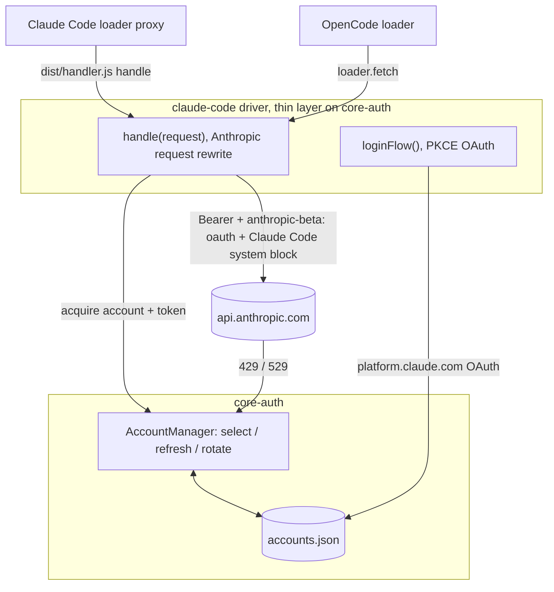

# claude-code-auth

[](https://www.npmjs.com/package/claude-code-auth)
[](https://www.npmjs.com/package/claude-code-auth)
[](https://github.com/intisy-ai/claude-code-auth/actions)

A [core-auth](https://github.com/intisy-ai/core-auth) provider that signs in to Claude with the real Claude Code OAuth flow and lets you add **multiple Claude subscription accounts**. Both Claude Code (via the loader proxy) and OpenCode route requests through it, rotating accounts and respecting each one's subscription rate limits, so OpenCode uses your Claude Code subscription instead of a pay-per-token API key.

## Under-the-Hood Architecture



## Structure

- `src/`
  - `driver/`, driver + OAuth config/login (request prep now round-trips through core-ir, java/claude-provider)
  - `oauth/`, PKCE flow
  - `commands.ts`, slash-commands
  - `handler.ts`/`index.ts`/`cli.ts`, entries
- `dist/`
  - `index.js`, OpenCode bundle
  - `handler.js`, Claude loader bundle
  - `cli.js`, CLI bundle

## Installation

### Via plugin-updater (recommended)

```bash
npx plugin-updater@latest init https://github.com/intisy-ai/claude-code-auth
```

### Via npm

```bash
npm install claude-code-auth
```

## Configuration

Config file: `<configDir>/config/claude-code.json` (edit via the loader or `/claude-code-config set`).

```json
{
  "logging": true,
  "max_account_attempts": 4,
  "account_selection_strategy": "hybrid",
  "default_cooldown_seconds": 60,
  "max_cooldown_seconds": 900
}
```

| Key | Default |
| --- | --- |
| `logging` | `true` |
| `max_account_attempts` | `4` |
| `account_selection_strategy` | `"hybrid"` |
| `default_cooldown_seconds` | `60` |
| `max_cooldown_seconds` | `900` |

## Commands

| Command | Description | Arguments |
| --- | --- | --- |
| `/claude-code-auth-config` | View and change claude-code-auth configuration | `list | get <key> | set <key> <value>` |
| `/claude-accounts` | List signed-in Claude subscription accounts |  |

## Dependencies

- `core`
- `core-auth`
- `sync-bridge`

## Logging

Logs are written to `<configDir>/logs/YYYY-MM-DD/claude-code-auth-HH-MM-SS.log` and are toggled by
this plugin's `logging` config (default on). Console mirroring is global, off by default,
and controlled by the shared `config/settings.json` `logConsole` flag.

## License

MIT.
